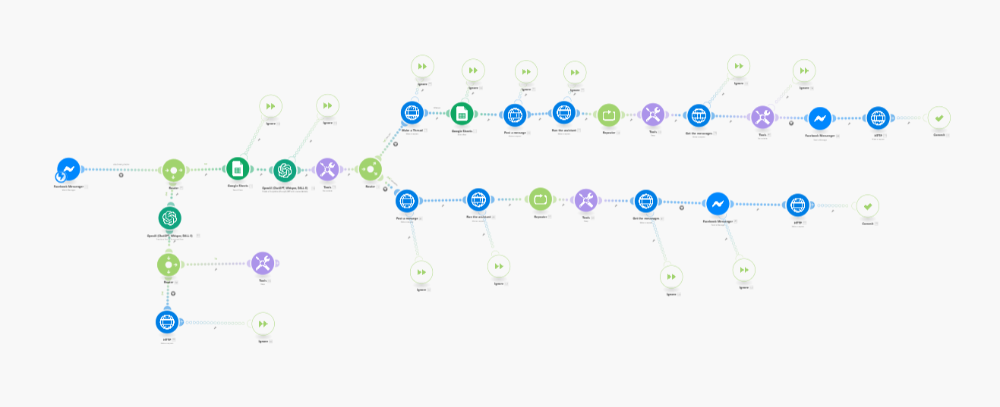

# 🤖 Managerium AI Chat Assistant (Make.com Automation)

This project contains a fully automated conversational workflow built using [Make.com](https://www.make.com/). It serves as a **virtual assistant** for the **Managerium Software** product, engaging with potential customers via **Facebook Messenger** even when no human sales rep is available.

---

## 📌 Overview

The chatbot leverages **OpenAI GPT models** to interpret user queries and provide intelligent responses. It is designed to handle basic questions, guide users through features, and store conversations for follow-up.

---

## 🧠 Key Features

- 💬 Auto-response via Facebook Messenger
- 🧠 GPT-powered replies (via OpenAI)
- 🗃️ Logs messages into Google Sheets
- 🔀 Advanced routing based on message type
- ♻️ Repeats structured data outputs
- 🌐 Integrates with APIs via HTTP module
- 🛠 Text parsing and response formatting

---

## 🔧 Tech Stack

| Component        | Tool / Service            |
|------------------|---------------------------|
| Automation Tool  | Make.com                  |
| Messaging        | Facebook Messenger        |
| AI Integration   | OpenAI ChatGPT            |
| Data Storage     | Google Sheets             |
| Custom Logic     | Routers, Repeater, Tools  |
| APIs             | HTTP module               |

---

## ⚙️ Setup Instructions

1. **Import or recreate the scenario** in Make.com.
2. Connect your **Facebook Page** to the Messenger module.
3. Set up **OpenAI API key** in the OpenAI modules.
4. Connect a **Google Sheet** to log messages.
5. Customize message content & filters based on Managerium product features.
6. Deploy the scenario and activate it.

---

## 📈 Example Use Case

> Customer: *“What can Managerium do?”*  
> Bot: *“Managerium helps you streamline team management, track progress, and automate reporting. Want a quick overview?”*

---

## 🔮 Future Plans

- Add WhatsApp support
- Qualify leads via scoring
- Integrate CRM for follow-up
- Analytics & reporting dashboard

---

## 🤝 Contributions

If you'd like to suggest improvements, open an issue or fork the repo and create a pull request.

---

## 📄 License

This project is licensed under the [MIT License](LICENSE).

---

